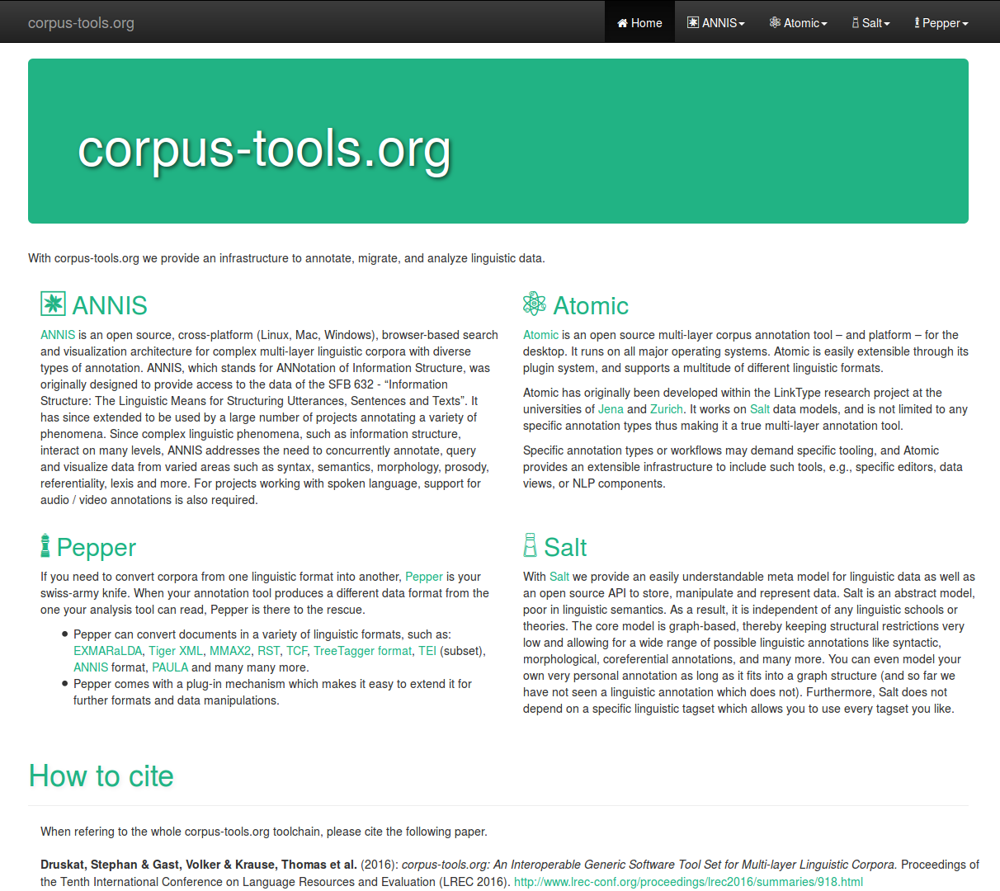

# MelaTAMP

## Data, methods, tools

Stephan Druskat, Research Software Engineer  
[MelaTAMP Research Project](http://hu.berlin/melatamp)  
Humboldt-Universität zu Berlin  
[stephan.druskat@hu-berlin.de](mailto:firstname.lastname@hu-berlin.de)  

Note: - Introduction about project by Ana
- I will give a different perspective on the project
- Methodological, data-centred

## What do we do?

### *In the MelaTAMP project, we perform agile, theory-informed, data-driven, corpus-based open linguistic research*

## What do we *actually* do?

#### We have corpora which we annotate and analyze, then publish the results.

Kilu von Prince, Ana Krajinovic and Manfred Krifka annotate and analyze corpora.
<!-- .element class="fragment" -->

I manage data and develop software.
<!-- .element class="fragment" -->

Note: - Basically simple I/O, input, processing, output
- And I will talk about some of the issues I deal with in my every day work here.

#### We have corpora which we annotate and analyze, then publish the results.

- "Corpora": Language data from 7 languages

- Data type? **Text (vs. audio) files!**  
*Established processing methods (parsing, regex, annotation, etc.)*
- Formats? **Toolbox text, FLEx backup file**** > ???**  
*Issues: Legacy software, no real format, compatibility, processability*  
***Solutions: [corpus-tools.org](http://corpus-tools.org), custom converters***

Note: - Toolbox and FLEx
- legacy software: open v closed source
- Detour: corpus-tools.org

### What's all this software?

- A **model** for all corpora: [Salt](http://corpus-tools.org/salt) > generic graph

 

### What's all this software?

- A **conversion framework** to rule all formats:  
[Pepper](http://corpus-tools.org/pepper) > intermediate model approach, modular

### What's all this software?

- A **search and visualization** infrastructure:  
[ANNIS](http://corpus-tools.org/annis) >  query language, modular  

### How does all this software help?

- **Salt** can take up our primary data and annotations
- With **Pepper** we can bring the different formats into the same model (via importers for Toolbox and FLEx) and export to other formats (ANNIS, etc.)
- With **ANNIS** we can search, visualize and (frequency) analyze the data

#### We have corpora which we annotate and analyze, then publish the results.

But wait! **"Our"** data, that we **"have"**?

Ours?  
***Authorship? Ownership? Licensing?***

Have!  
***Versioned (git)! Collaboration (git)!  
Unified (naming conventions)!***

Keep?  
***Management? Long-term accessibility? Licensing? Interfaces (repositories)? Data management plan!***

#### We have corpora which we annotate and analyze, then publish the results.

Methodology!

- Agile corpus creation: Iterative cycles of *querying*, *modeling*, *annotation*, *analysis*
- Tools: CLI (regex), text editors, Pepper, ANNIS

#### We have corpora which we annotate and analyze, then publish the results.

*What are our results?*

- **"Traditional" results:** Analyses & findings
- **Other results:** Software, data sets

*How do we publish?*

- **"Traditional" venues:** Papers, talks, etc.
- **Software:** Repositories (open source!), papers?
- **Data sets:** Repositories (licensing?), papers?

## Thank you!

# Questions?

[Online version](https://sdruskat.github.io/melatamp-intro-talk)